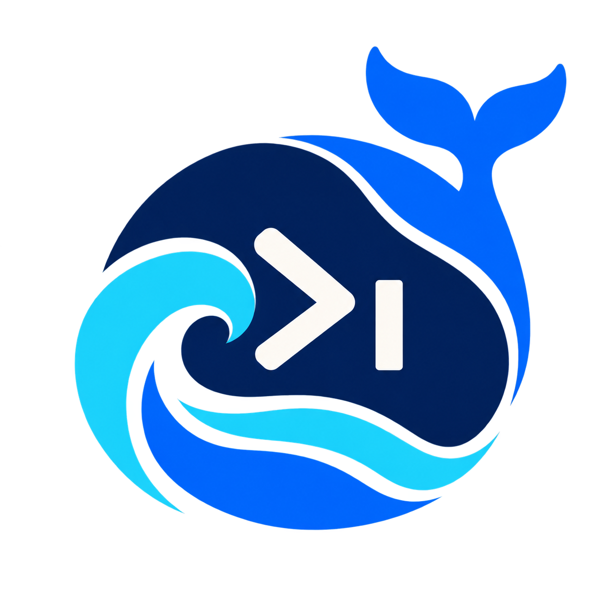

<p align="center"></p>
<h1 align="center">dsh-tui</h1>
<p align="center"><a href="https://github.com/deepseek-ai/deepseek-harness">DeepSeek Harness</a>: TUI!</p>

A minimal TUI for DSH.


```shell
npm i -g @deepseek-ai/dsh
dsh plugin --profile tui add "github:xiaoshihou514/dsh-tui#main"

dsh --profile tui
```

[MIT](LICENSE)

- [dsh-desktop-pet](https://github.com/xiaoshihou514/dsh-desktop-pet)
- [dsh-weixin](https://github.com/xiaoshihou514/dsh-weixin)
- [dsh-vision](https://github.com/xiaoshihou514/dsh-vision)
